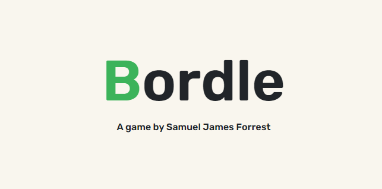

# Bordle

Calling all geography lovers 🌍 Challenge yourself by finding the mystery country based on its neighbours. For each incorrect guess, a new bordering country will reveal itself.

This game was created using the [Rest Country API](https://restcountries.com/) to output information about each countries and its borders.

The colours for this project were taken from [ColorHub](https://colorhub.vercel.app/) - created by the fantastic [Daniel Cranney](https://twitter.com/danielcranney).

If you would like suggest features for future iterations of the game - feel free to contact me via [Twitter](https://twitter.com/samueljforrest)

## Releases

### V.1.0.0 (27.04.2022)

#### Features

**Current Features**

- Game randomly generates mystery countries, meaning that no two games are the same.
- Game is available on all devices (mobile, tablet, desktop)

**Future Features**

- Hint: add in a button that gives the player a hint about the mystery country.

#### Bugs/Fixes

**Country Names Error Handling**

- Bug: Many of the countries' names were were not the commonplace English version of the name - for example, 'Syria' is called 'Syrian Arabic Republic'. This was a problem for two reasons:
  - The names were always longer, meaning the name took up more space - which was particularly problematic on mobile screens, pushing content out of the viewport.
  - The user would have to guess the more complicated version of the name in its entirety, which I was afraid would make for a frustrating user experience.
- Fix: I added the `catchNames` function, which takes a list of names and checks for the names I had identified as being complicated; then, it replaces those with the commonplace version (i.e. replacing 'Russian Federation' to 'Russia').
