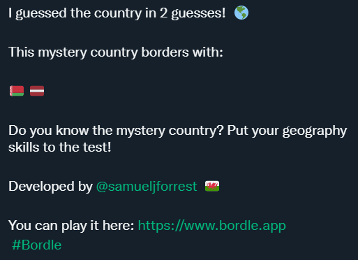

# Bordle

Calling all geography lovers 🌍 Challenge yourself by finding the mystery country based on its neighbours. For each incorrect guess, a new bordering country will reveal itself.

This game was created using the [Rest Country API](https://restcountries.com/) to output information about each countries and its borders.

The colours for this project were taken from [ColorHub](https://colorhub.vercel.app/) - created by the fantastic [Daniel Cranney](https://twitter.com/danielcranney).

If you would like suggest features for future iterations of the game - feel free to contact me via [Twitter](https://twitter.com/samueljforrest)

## Releases

### V.1.0.1

**Added Features**

- Sanitised user input by trimming any whitespace from the input's value. This was particularly problematic as mobile autocorrect often leaves a space after a word has been selected.
- Added LinkedIn link to game over screen
- Removed pointer events from all images to stop user being able to see the flag by dragging the image.
- Added a new Twitter message when the player is successful. The new message shows how many guesses it took the player to find the mystery country, and emojis of the flags the player had uncovered before guessing.
  
  **Credit**: credit to [Risan](https://github.com/risan/country-flag-emoji) for his excellent flag emoji API, which I used - in conjunction with the Rest Countries API - to output the flag emojis.
- Added a datalist to the input, to show the player potential answers, and help with spelling of difficult country names (thanks Kyrgyzstan). This datalist also filters depending on what the user has entered.

### V.1.0.0 (27.04.2022)

#### Features

**Current Features**

- Game randomly generates mystery countries, meaning that no two games are the same.
- Game is available on all devices (mobile, tablet, desktop)

**Future Features**

- Hint: add in a button that gives the player a hint about the mystery country.

#### Bugs/Fixes

**Country Names Error Handling**

- Bug: Many of the countries' names were were not the commonplace English version of the name - for example, 'Syria' is called 'Syrian Arabic Republic'. This was a problem for two reasons:
  - The names were always longer, meaning the name took up more space - which was particularly problematic on mobile screens, pushing content out of the viewport.
  - The user would have to guess the more complicated version of the name in its entirety, which I was afraid would make for a frustrating user experience.
- Fix: I added the `catchNames` function, which takes a list of names and checks for the names I had identified as being complicated; then, it replaces those with the commonplace version (i.e. replacing 'Russian Federation' to 'Russia').
